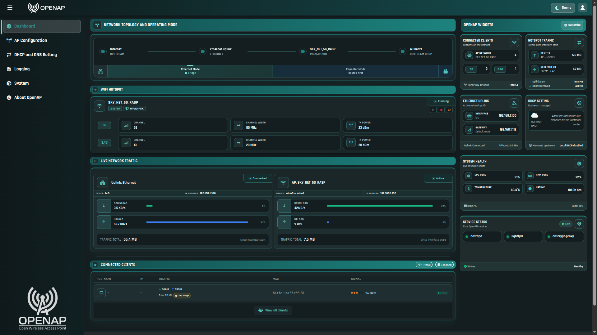
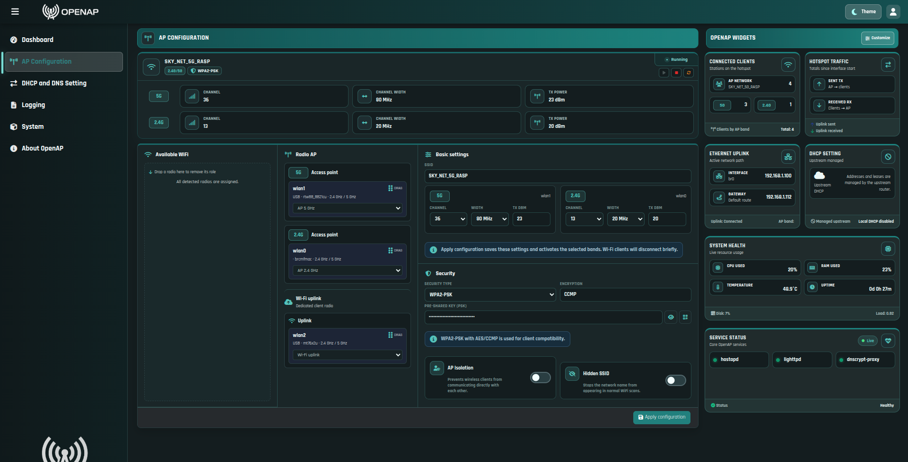
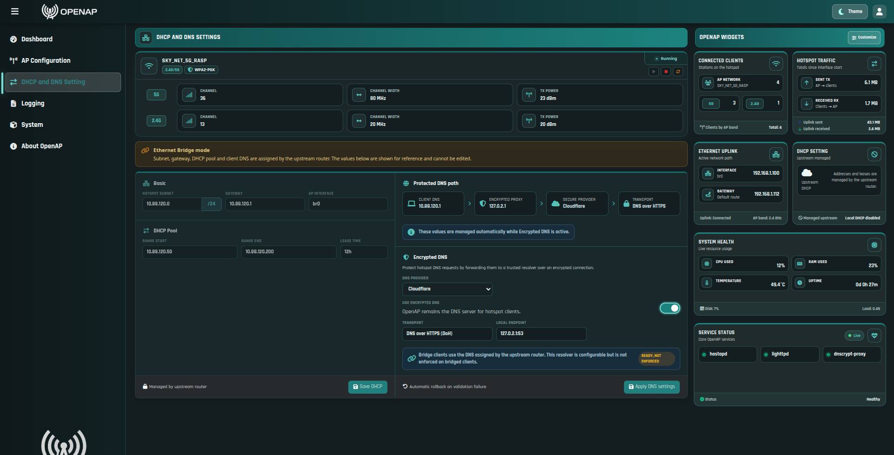
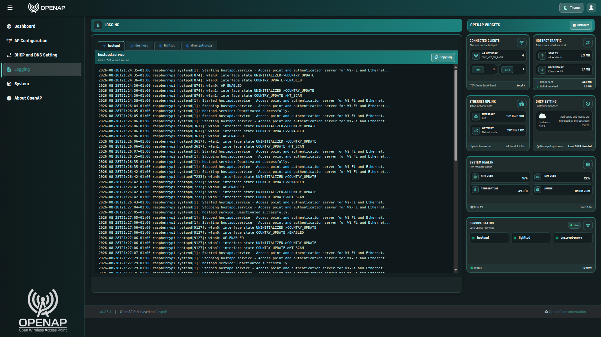
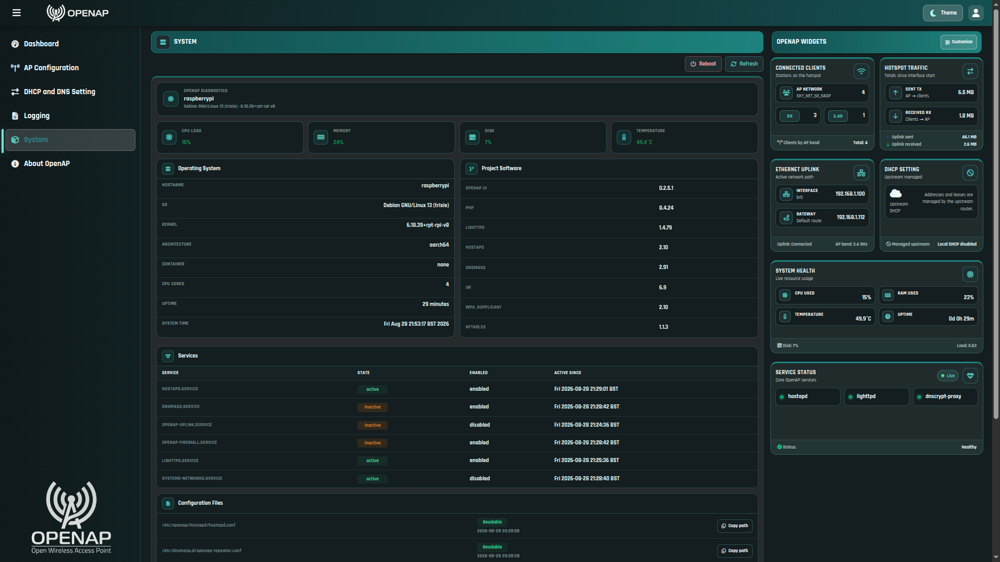

# OpenAP

[](https://github.com/AngelsWillRule/OpenAP/releases/latest)
[](https://github.com/AngelsWillRule/OpenAP/actions/workflows/ci.yml)
[](LICENSE)

OpenAP turns supported Debian-based systems into a web-managed wireless access
point, dual-band hotspot or Wi-Fi repeater. It combines hardware-aware radio
management, DHCP/DNS, encrypted DNS, nftables forwarding and live system
status in one responsive interface while keeping privileged network changes in
explicit root-owned helpers.

> **Current stable release:** [OpenAP 0.8.0](https://github.com/AngelsWillRule/OpenAP/releases/tag/v0.8.0).
> Use the versioned archive and its published SHA-256 checksum for a
> reproducible installation.

## What OpenAP does

- creates single-band or simultaneous 2.4 GHz and 5 GHz hotspots over an
  Ethernet uplink;
- detects interfaces by capability and hardware identity instead of assuming
  names such as `wlan0` or `eth0`;
- assigns persistent `ap_24ghz`, `ap_5ghz` and `uplink` roles and supports
  transactional role swaps between compatible radios;
- detects late, removed, reinserted and replacement Wi-Fi hardware and updates
  AP Configuration, Repeater Mode and Network Topology live;
- provides dynamic hotspot addressing, DHCP, DNS policy, encrypted DNS and
  nftables-based forwarding for hotspot clients;
- switches among WiFi Repeater Mode, Ethernet Routed NAT and Ethernet Bridge
  without reinstalling OpenAP;
- manages saved Wi-Fi uplinks without returning stored passphrases to the
  browser;
- exposes per-band channel, width and transmit-power controls, Wi-Fi QR codes,
  clients, traffic, logs, service health and per-user widgets through a
  responsive light/dark interface;
- preserves and restores pre-existing shared-service configuration and state
  during installation and removal.

The initial installer intentionally offers only the validated AP-over-Ethernet
flow. Repeater Mode is selected later from the dashboard.

## Operating modes

| Mode | Purpose |
| --- | --- |
| Ethernet Routed NAT | Runs the hotspot on an isolated subnet with OpenAP DHCP/DNS and nftables forwarding |
| Ethernet Bridge | Bridges hotspot clients to the upstream Ethernet network and its DHCP/DNS services |
| WiFi Repeater | Uses a separate managed-mode radio as the wireless uplink |

Mode changes use ordered readiness checks and transactional recovery for
interfaces, bridges, routes, hostapd, dnsmasq, encrypted DNS, firewall and the
uplink watchdog. The Dashboard follows the confirmed runtime state rather than
assuming a transition succeeded.

## Interface preview

These screenshots are illustrative previews of the OpenAP interface and the
features users can expect. Runtime values, interface names, addresses and
version labels depend on the system and the installation captured.

### Dashboard



### AP Configuration



### DHCP and DNS



### Logging



### System



## Supported and tested platforms

| Platform | Status |
| --- | --- |
| Debian 13 x86-64 | Tested; intended for physical machines and VMs |
| Ubuntu 26.04 x86-64 | Tested; intended for physical machines and VMs, including Incus |
| Current Raspberry Pi OS 64-bit on Raspberry Pi 3B+ | Tested |
| Raspberry Pi 4 and 5 | Expected compatible; physical reports wanted |
| Other Debian-like systems | Experimental |

The tested labels apply to the exact `0.8.0` release archive and checksum.
On x86-64, OpenAP is designed to run on both physical hardware and virtual
machines. Incus has been validated with bridged networking and Wi-Fi hardware
passthrough; other hypervisors should expose equivalent Ethernet and Wi-Fi
devices that satisfy the hardware prerequisites below.

## Hardware prerequisites

> **Important:** Update the operating system completely before installing
> OpenAP. The installer checks APT/dpkg state but does not update, repair or
> upgrade the host. Run `sudo apt update` and `sudo apt full-upgrade`, then
> reboot when required, before starting the installation.

> **Important:** Every Wi-Fi adapter intended for OpenAP must already be
> detected and operational before the installer is started. OpenAP does not
> install firmware, kernel drivers or third-party driver packages, and the
> project cannot provide hardware-specific driver installation support.

Before installation, the operating system must expose:

- a working Ethernet uplink;
- at least one Wi-Fi interface supporting AP mode;
- a valid regulatory country.

Repeater Mode requires a second Wi-Fi interface capable of managed/client mode.
Verify the intended adapters before running the installer:

```bash
iw dev
ip -brief link
```

See [Hardware and Wi-Fi prerequisites](docs/HARDWARE.md).

## Installer preview

The detector and installer live in `openap-installer/bin`.

To install on a clean supported system, install Git and clone the tagged
release:

```bash
sudo apt update
sudo apt install -y git
git clone https://github.com/AngelsWillRule/OpenAP.git
cd OpenAP
git checkout v0.8.0
```

Read-only detection:

```bash
openap-installer/bin/openap-detect
openap-installer/bin/openap-detect --json
```

Dry run, which makes no changes:

```bash
openap-installer/bin/openap-install
```

Interactive installation:

```bash
sudo openap-installer/bin/openap-install --apply
```

See the [complete installation guide](docs/INSTALLATION.md) for prerequisites,
the dry run and post-installation checks.

Headless unattended installations must provide unique passwords through
`OPENAP_HOTSPOT_PASSWORD` and `OPENAP_ADMIN_PASSWORD`. With an attached
terminal, `--yes` generates unique passwords and displays them once at the end.
Review the complete [installation guidance](docs/INSTALLATION.md) before
deployment.

The installer performs a read-only APT/dpkg preflight and stops if the host has
missing package indexes, incomplete configuration, broken dependencies or
pending upgrades. It installs only OpenAP dependencies with `--no-upgrade` and
does not update, repair or upgrade the operating system automatically.

## Security model

The Lighttpd/PHP dashboard runs without unrestricted root access. Network
changes are delegated to narrowly named helpers under `/usr/local/sbin`, with
corresponding sudoers rules generated for detected interfaces and supported
operations. Repository sources, installer scripts and project documentation
are excluded from the installed webroot.

OpenAP does not enable WAN access to the dashboard by default. Administrators
remain responsible for host firewall policy, physical security and applying
operating-system security updates.

Report vulnerabilities privately as described in [SECURITY.md](SECURITY.md).

## Current limitations

- headless unattended installation requires explicit hotspot and administrator
  passwords in the installer environment;
- Repeater Mode requires two suitable Wi-Fi radios;
- WPA3-only Wi-Fi uplinks are not supported;
- the full multi-radio rollback path still needs deliberate fault-injection
  validation;
- Raspberry Pi 4/5 compatibility has not yet been physically validated;
- other Debian-like systems remain experimental;
- OpenAP installs no Wi-Fi firmware or driver.

## Documentation

- [Changelog](CHANGELOG.md)
- [Documentation index](docs/README.md)
- [Installation](docs/INSTALLATION.md)
- [Hardware prerequisites](docs/HARDWARE.md)
- [WiFi Repeater Mode](docs/REPEATER_MODE.md)
- [Troubleshooting](docs/TROUBLESHOOTING.md)
- [Feature roadmap](docs/OPENAP_FEATURE_ROADMAP.md)

## Relationship to RaspAP

OpenAP is derived from [RaspAP](https://github.com/RaspAP/raspap-webgui) and
retains the GNU GPL version 3 license, original copyright notices and upstream
authorship information. OpenAP is an independent project and is not endorsed
by or affiliated with RaspAP unless explicitly stated otherwise.

See [NOTICE.md](NOTICE.md) for provenance and
[THIRD_PARTY_NOTICES.md](THIRD_PARTY_NOTICES.md) for the ongoing dependency
license audit.

## Contributing

Code, documentation and hardware-validation contributions are welcome through
the workflow in [CONTRIBUTING.md](CONTRIBUTING.md). Reports from additional
Wi-Fi adapters, Raspberry Pi 4/5 hardware and virtualized environments are
particularly useful.

## License

OpenAP is distributed under the [GNU General Public License version 3](LICENSE).
